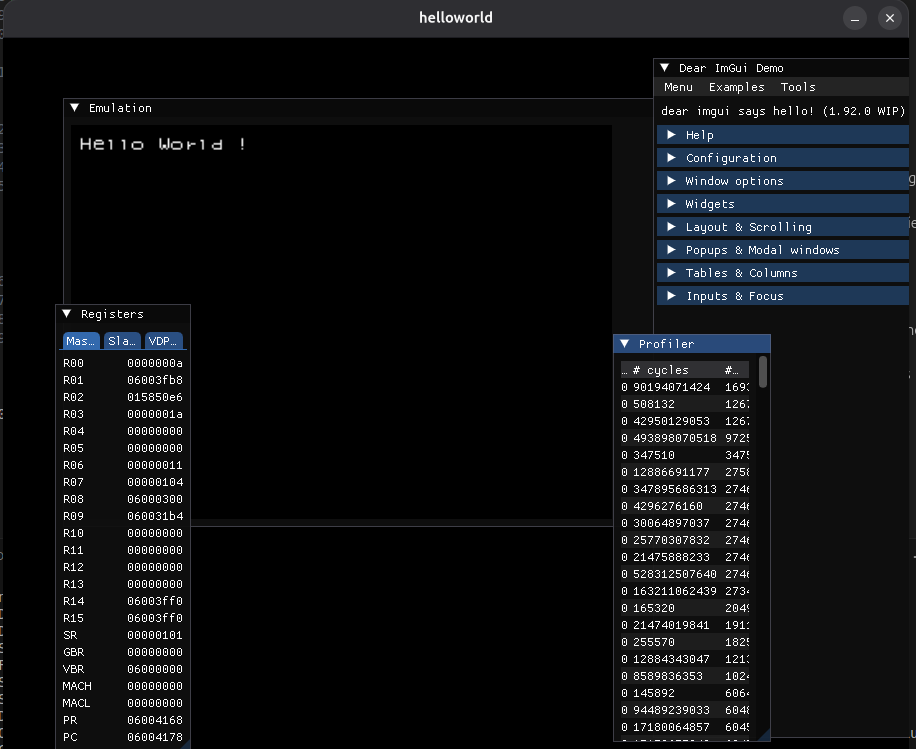
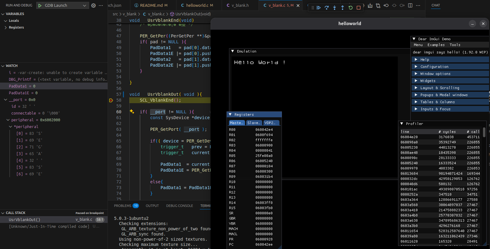

# satun_helloworld
SEGA Saturn HelloWorld with SBL

Based on smpdbg10 SBL sample code.

## How to build :

rm -rf * && cmake -DCMAKE_INSTALL_PREFIX=/saturn .. && make && make install

(see https://github.com/willll/saturn-docker for a toolchain)

## Build in DEBUG

rm -rf * && cmake -DCMAKE_BUILD_TYPE=Debug \
      -DCMAKE_TOOLCHAIN_FILE=$SATURN_CMAKE/sega_saturn.cmake \
      -DCMAKE_INSTALL_PREFIX=/saturn/ .. && make && make install

## Where sources shall be stored:

addr2line -a 0x60055be -p -i -f -C -e ./helloworld.elf

## Screenshot

## Debug with Visual Studio Code

### Prerequisites
- Install the C/C++ extension,
- Install https://github.com/willll/mednafenSSDev,
- Install GDB Multiarch, or build your own for SH2 (https://github.com/willll/Saturn-SDK-GCC-SH2)

### Build from VSCode

The tasks.json is currently configured to buid remotely through SSH, or from a local Docker image (https://github.com/willll/saturn-docker), that shall be modified to match your setup.

### Debug

tasks.json defines "Run with Mednafen" task, that will start the emulator, once started, it will start listening on port 43434 (TCP ?).

"GDB Launch" is defined within launch.json, start it, it *should* connect.

